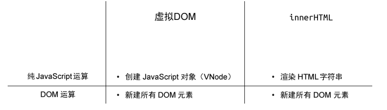
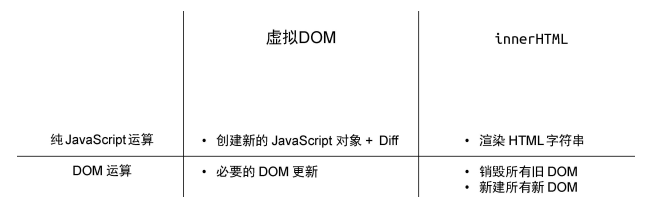
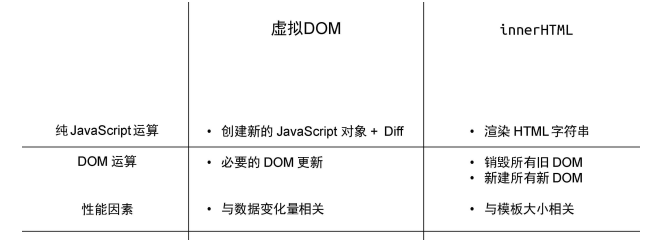
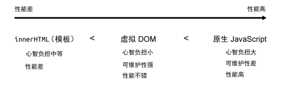

# 读《Vue.js设计与实现》有感
## 前言
本文，主要是阅读**《Vue设计与实现》**这本书之后的总结与概括，其中包含笔者自己的相关感受和体验，当然这本书本身是基本不涉及源码部分的，但是本文会针对自己阅读vue3.4源码过后的经验，对相关部分增加源码的解读和感受。

**《Vue.js设计与实现》**这本书是vue研发团队的一员写的，本身也极受尤大推荐，这里笔者也极其推荐读者自己去阅读一下这本书，当然最好本身就拥有相关的工程化经验和vue使用经历。
## 引言
**《Vue.js设计与实现》**本身将Vue形象地分为五个模块进行解读，笔者也将会从以下六个角度谈谈自己的感受：
1. 框架设计概览
2. 响应系统
3. 渲染器
4. 组件化
5. 编译器
6. 服务端渲染

当然Vue本身也就是基本分为除了框架设计概览的这五个模块（reactivity、runtime-core等等）

相较于Vue2而言，Vue3不仅偿还了许多技术债务，而且做到更多的性能优化和功能拓展，就笔者了解而言，相较于Vue2它大致有以下几个方面的优点：
1. **拆分与设计**：模块之间的耦合低，可以单模块使用，而不需要依赖完整的Vue.js
2. **内建组件和模块**：使用rollup和esbuild以及Tree-Shaking实现内建的按需引入，从而实现bundle最小化
3. **拓展能力强**：可以自定义renderer，甚至可以自定义parser来自定义模板语法

当然除以上外，还有许多优点，例如使用proxy优化响应式系统、优化diff算法等等，这些笔者在接下来的正文部分会提及。

总之，本文将沿着**《Vue.js设计与实现》**该书继续对Vue的内部实现做出一一列举和解释。
## 正文
### 一、框架设计概览

#### 1.1 权衡的艺术
本部分该书主要说明为什么vue在声明式与命令式，运行时和编译时的选择中权衡，并作出声明式以及运行时和编译时的选择

##### 命令式和声明式
本节主要说明了什么是命令式和声明式的概念。

简而言之：
- 命令式：关注过程，强调过程中的每一个操作
- 声明式：关注结果，封装过程

可以简单理解为命令式就是每一步都自己亲自执行，而声明式是构造一个函数通过调用这个函数去执行。

例如，jquery作为一个命令式框架在实现绑定点击事件时：
```js
const div = document.getquerySelector('#app'); // 获取div
div.innerText = 'hello world' // 设置内容
div.addEventListener('click',()=>{}); // 绑定事件
```
在这个过程中，从获取节点到绑定事件，每一步都是不能省略需要执行的，而作为声明式的Vue却只需要:
```html
<div @click="()=>{}">hello world</div>
```
这里的模板语法就有点类似一个函数，我们通过去使用它，它帮我们实现最后的绑定操作。

当然它的背后还是进行一系列的操作的，只不过它进行了封装不暴露出来，让我们无需关注那一部分

##### 性能和可维护性的权衡
本节对声明式和命令式的优劣进行权衡

**声明式代码性能优于命令式代码**

如上文所说，其实声明式本质就是一个个命令式的封装。
可以简单理解为声明式是：A+B+C=D，这个D就是我们能使用的最小的声明式操作，显然，当我们仅需要A操作的时候，声明式的性能消耗要大于命令式。

那么为什么不选择命令式呢？显然在我们开发时不可能关注到每个操作，例如我们不可以手动完成每个DOM的创建、更新、删除。

总之使用声明式增加了代码的可维护性，但是降低了性能。

##### 虚拟DOM的性能到底如何
本节讨论了在上一节提及的声明式降低性能情况下让代码降低性能最低化的手段————虚拟dom

显然既然要降低声明式的性能，就不能执行每个操作

例如：我们要执行A操作，使用声明式时如果不额外处理将会额外进行B、C操作带来性能浪费，所以这时我们可以通过找出差异，判断出我们只需要进行A操作，假设找出差异这次行为为E，那么就将 A+B+C -> A+D；

你可能会疑惑我这不还是引入了D操作吗，这个操作未必比B+C要小啊？

确实。但是请你先继续看下去。

首先，我们前端开发主要的操作是进行DOM操作，而DOM操作的性能开销是远大于JS操作的。

不信的话你可以自己试试下面这两段代码的耗时：
```js
const app = [];
let i = 10000;
while(i) {
    i--;
    const div = {tag:'div'}
    app.push(div)
}

const app = document.querySelector('#app')
let i =10000;
while(i) {
    i--;
    const div = document.creatElement('div');
    app.appendChild(div);
}
```

往往在执行所谓的A+B+C操作时，我们使用字符串拼接的方法。
那么在初始化的过程中有以下图的比较：

那么在更新时：

通过上述我们发现在更新操作时所谓的D就是Diff，他作为JS层面的操作显然是要远远小于B+C+...也就是剩余的销毁旧DOM和创建新DOM的性能消耗。

我们也不难发现，当页面越大，也就是B+C+...后面需要进行的DOM操作更多，这种diff的局部替换性能优势也就越强。

我们总结下上述过程，则有这个图：


基于此，我们再将使用innerHTML全量替换和虚拟DOM以及原生JS操作(命令式)进行比较：


综上权衡，最后选择了使用虚拟DOM进行更新。

虽然我们还没讲虚拟DOM到底是啥，但是你应该能大致感知到，它其实就是一个JS对象了吧。

##### 运行时与编译时
本节探讨了纯运行时、纯编译时和运行时+编译时的优劣
